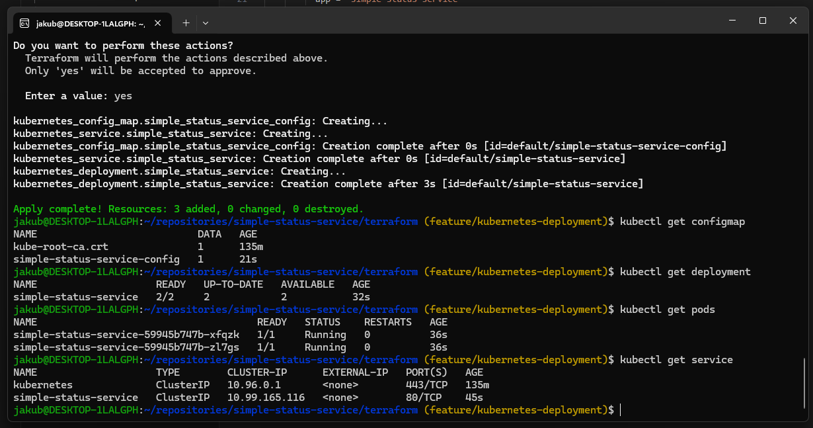
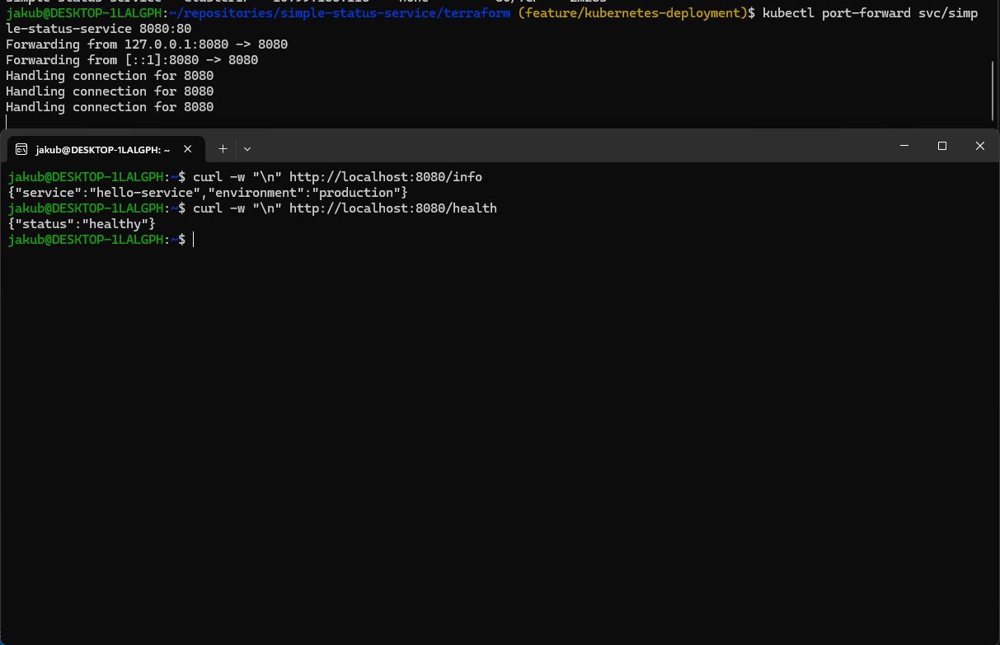

# Simple Status Service

Simple FastAPI service exposing two endpoints: `/health` and `/info`.  
The project demonstrates how to run the application:

1. locally using Docker  
2. inside Kubernetes using Terraform (Infrastructure as Code)

---

# 1. Requirements

You need:  
- Docker Desktop with Kubernetes enabled (includes kubectl)
- Terraform  
- curl  
- git
- A terminal that can run these tools (WSL (Ubuntu) was used here)  


Clone the repository:  
```git clone https://github.com/ser1sto/simple-status-service.git```

---

# 2. Part 1 – Running the app with Docker

## 2.1 Build the image

From the project root directory:

```docker build -t simple-status-service:latest .```


## 2.2 Run the container

```docker run --rm -p 8080:8080 -e APP_ENV=dev simple-status-service:latest```


## 2.3 Test the endpoints

In a second terminal:

```curl -w "\n" http://localhost:8080/health```

```curl -w "\n" http://localhost:8080/info```

Expected:

- `/health` shows the service name and environment  
- `/info` confirms the app is healthy  

### Result


---

# 3. Part 2 – Deploying to Kubernetes using Terraform

In this part, the service runs in a Kubernetes cluster provided by Docker Desktop. **Note that the image tag used in this part is different than in part 1 and therefore needs to be built.**

---

## 3.1 Build the image

```docker build -t simple-status-service:local .```

---

## 3.2 Apply the Terraform configuration

Go to the Terraform directory:

```cd terraform```

Initialize Terraform:

```terraform init```

Show changes:

```terraform plan```

Apply:

```terraform apply```

Enter **yes** when asked.  
Terraform will create the Kubernetes resources.

---

## 3.3 Check Kubernetes resources

### Pods

```kubectl get pods```

2 pods in the Running state should be visible.

### Deployment

```kubectl get deployment```


### Service

```kubectl get service```


### Result



---

## 3.4 Access the service using port-forwarding

Because the Service is internal (ClusterIP), expose it locally:

```kubectl port-forward svc/simple-status-service 8080:80```

Keep this terminal open while testing.

---

## 3.5 Test the endpoints running in Kubernetes

In a second terminal:

```curl -w "\n" http://localhost:8080/info```

```curl -w "\n" http://localhost:8080/health```

### Result



---

# 4. Cleanup

Destroy Terraform-managed resources:

```terraform destroy```

Enter **yes** when asked.  
Terraform will destroy the Kubernetes resources.

---

# 5. Architecture & Decisions

### Chosen solution
I used Terraform as the main deployment method. It provides a clear Infrastructure-as-Code workflow and is more real-world approach in my opinion.

### Kubernetes environment
The project uses Docker Desktop with Kubernetes enabled. This choice keeps the setup simple and does not require external tooling and is easy to set-up.

### Approach and trade-offs
The application is containerized with Docker and deployed to Kubernetes through Terraform.  
To keep the workflow simple and fully local, the Deployment uses a local Docker image with ```image_pull_policy = "Never"```. Without it - k8s deployment was contantly trying to pull some external image resulting in ```ErrImagePull```.  
